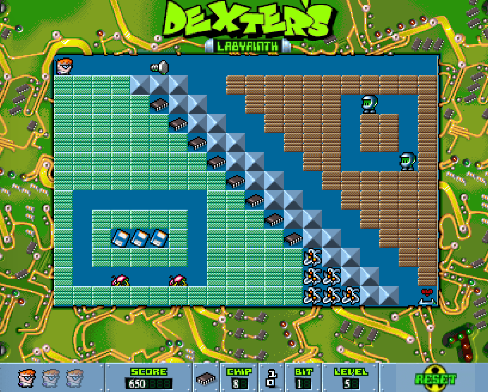

## README: Dexter's Labyrinth Clone

Dexter's Labyrinth is a maze-puzzle game where the player takes control of Dexter, a boy genius who must repair his infected computer in a virtual world. The game is played on a 20 x 13 grid, and Dexter moves one grid square at a time. The player must collect chips to progress to the next level, while avoiding enemies and hazards.

### Gameplay

Dexter starts with three lives and a score of zero. The player must navigate through each level, avoiding enemies and hazards such as falling objects and walls. The game features different types of enemies, some of which are more difficult to evade than others. As the player progresses through the levels, new enemies and more complex mazes are introduced.



The game includes objects called chips and bits that the player can collect to increase their score. Dexter can also push screws, which can be used to eliminate enemies or create paths through the maze. However, if a screw falls on Dexter's head, he will lose a life. When an enemy is defeated, it transforms into six chips.

### Controls

#### Directional Buttons:
* Up: Move Dexter upwards.
* Down: Move Dexter downwards.
* Left: Move Dexter to the left.
* Right: Move Dexter to the right.

#### Keyboard Keys:
* A: Move Dexter to the left
* W: Move Dexter upwards.
* D: Move Dexter to the right.
* S: Move Dexter downwards.

### Copyright

This project is an open source clone of the game Dexter's Labyrinth. While the original game is no longer available, some of the sprites used in this project belong to the original creators.

Please note that this project is not intended for commercial use and is solely for educational purposes as part of a programming course. All credit for the original game and its assets goes to their respective owners.

If you are the owner of any of the assets used in this project and would like them removed, please contact me and I will take appropriate action.

I do not claim ownership over any of the original game's intellectual property, and this project is not affiliated with, endorsed by, or sponsored by the original creators or publishers of the game.

Thank you for understanding and respecting the intellectual property rights of others.

### Installation

To use this repository for development, follow these steps:
1. Clone the repository to your local machine using git clone
2. Navigate to the cloned repository directory, and install the dependencies using npm
```
npm install -E
```
* To compile the application in development mode and serve it on a local server
```
npm run start
```

### Acknowledgments

This game was inspired by the original game Dexter's Laberynth. Thank you to the creators of the original game for the inspiration.